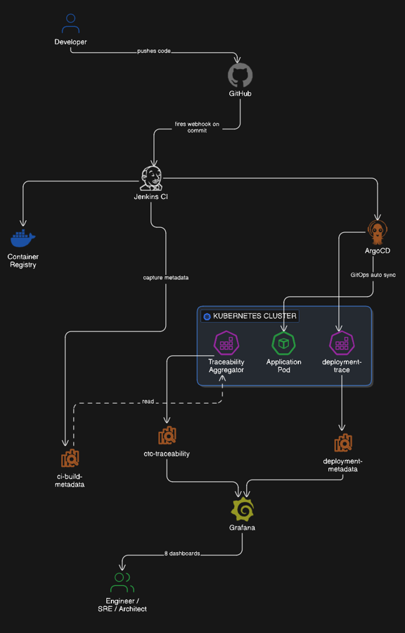

# Code-to-Container Traceability & Observability Platform

> **End-to-end CI → CD → Runtime → Health → Metrics → Impact observability**  
> built using Docker, Jenkins, ArgoCD, Kubernetes, OpenSearch, Prometheus, and Grafana.

---

## 📌 Overview

Modern CI/CD pipelines typically answer **what was built** and **what was deployed**,  
but they fail to answer the most critical operational question:

> **What code is actually running in the cluster right now, and how is it behaving?**

This project solves that problem by providing **true Code-to-Container Traceability** —  
linking:

**Git commits → Jenkins builds → container images → Kubernetes pods → runtime behavior**

into a **single, unified observability platform**.

⚠️ **Important**  
This is **not** just a dashboard collection.  
It is a **data-driven traceability system** designed from first principles using real SRE practices.

---

## ✨ What Makes This Project Unique

- ✅ End-to-end **code lineage** (commit → build → image → pod)
- ✅ Runtime truth sourced directly from Kubernetes
- ✅ Clear separation of **CI claims** vs **actual runtime state**
- ✅ Correlation of **deployments with performance and stability impact**
- ✅ No dependency on vendor-specific APM tools
- ✅ Built using **open standards and open-source components**

> To the best of my knowledge, this **complete end-to-end flow is not publicly documented or implemented** as a single reference architecture.

---

## 🧠 Architecture & Data Flow

> Click the image to view in full resolution.

[](Architecture/Architecture.png)

---

## 🧩 Core Components

### 🔹 CI Layer (Build Truth)

- **Jenkins**
- Captures:
  - `build_id`
  - `job_name`
  - `branch`
  - commit metadata
  - authors
  - image tag & immutable image digest
- Indexed into **OpenSearch (`ci-build-metadata`)**

---

### 🔹 CD Layer (Deployment Truth)

- **ArgoCD**
- Captures:
  - deployment name
  - namespace
  - pod name
  - image & digest
  - node placement
- Indexed into **OpenSearch (`deployment-metadata`)**

---

### 🔹 Runtime Traceability Layer (Source of Truth)

- **Custom Traceability Aggregator**
- Enriches live Kubernetes runtime data with:
  - CI build metadata
  - Image digest verification
  - Pod classification (`application` / `system`)
- Produces the **final truth layer**
- Indexed into **OpenSearch (`ctc-traceability`)**

---

### 🔹 Metrics Layer

- **Prometheus**
- Collects:
  - CPU usage
  - Memory usage
  - Resource requests & limits
- Used to correlate **deployments with runtime impact**

---

### 🔹 Visualization Layer

- **Grafana**
- Datasources:
  - OpenSearch (traceability & metadata)
  - Prometheus (metrics)
- Provides **correlated, low-noise dashboards**

---

## 📦 OpenSearch Indexes & Purpose

| Index Name            | Purpose |
|-----------------------|--------|
| `ci-build-metadata`   | Build-time truth from Jenkins |
| `deployment-metadata`| Deployment-time truth from ArgoCD |
| `ctc-traceability`    | Runtime truth combining CI + CD + Kubernetes |

This separation ensures:
- No data duplication
- Clear responsibility boundaries
- Accurate historical traceability

---

## 📊 Dashboards Included

### 1️⃣ Jenkins Build Trace Dashboard  
**Purpose:** CI visibility  
- Latest builds
- Build status
- Commit & author metadata
- Image artifacts

---

### 2️⃣ ArgoCD Deployment Monitoring Dashboard  
**Purpose:** CD visibility  
- Latest deployments
- Namespace & pod placement
- Deployment status

---

### 3️⃣ Code-to-Container Traceability Dashboard ⭐  
**Purpose:** Runtime truth  
- Build → Pod → Node mapping
- Image digest consistency
- Application vs system pods

---

### 4️⃣ Pod Health & Runtime Status Dashboard  
**Purpose:** Stability monitoring  
- Pod status distribution
- Restart detection
- Node-level health signals

---

### 5️⃣ Application Release History Dashboard  
**Purpose:** Audit & rollback analysis  
- Build rollout timeline
- Image digest evolution
- Pod replacement history

---

### 6️⃣ Kubernetes Resource Utilization Dashboard  
**Purpose:** Capacity & performance  
- CPU usage
- Memory usage
- Requests vs actual usage ratio

---

### 7️⃣ Deployment Impact & Regression Dashboard ⭐  
**Purpose:** Change impact detection  
- Deployment events vs CPU/memory
- Restart correlation after releases
- Stability regression signals

---

### 8️⃣ Master Observability Overview Dashboard ⭐  
**Purpose:** Single-pane-of-glass  
- Latest build & deployment
- Runtime truth snapshot
- Health & resource summary
- Deployment stability verdict

---

## 🛠 Installation (ArgoCD)

ArgoCD is installed using the **official upstream manifest**, version pinned for reproducibility.

### Install Script

```bash
sudo sh ArgoCD-Setup/install-argocd.sh


## 🎯 Key Observability Principles Used

- **Runtime truth over pipeline claims**
- **Artifact immutability via image digests**
- **Correlation over isolated visualization**
- **Low-noise, high-signal dashboards**
- **Production-first design**

This project intentionally avoids:
- Blind log dumping
- Uncorrelated metrics
- Vendor lock-in APM assumptions

---

## 🛡 License

This project is licensed under the **MIT License**.

You are free to:
- Use
- Modify
- Distribute
- Extend

With proper attribution.

---

## 🚧 Project Status

- 🟢 Actively maintained
- 🟢 Designed for real production patterns
- 🟢 Open to extensions (alerts, SLOs, multi-cluster)

---

## 🙌 Author

**Narendra Sivangula**  
Cloud & DevOps Engineer  

Focus areas:
- Kubernetes
- CI/CD
- Observability
- Production Reliability

---

## ⭐ Why This Project Matters

Most systems answer:

> “Did the pipeline succeed?”

This project answers:

> **“Is the right code running, is it healthy, and did my change cause impact?”**

That distinction is **everything in production systems**.

